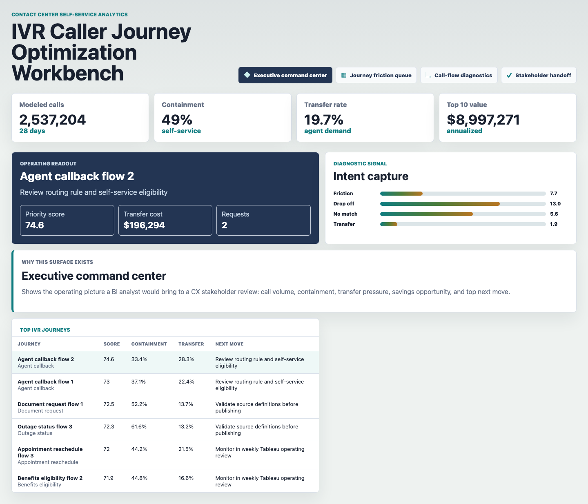
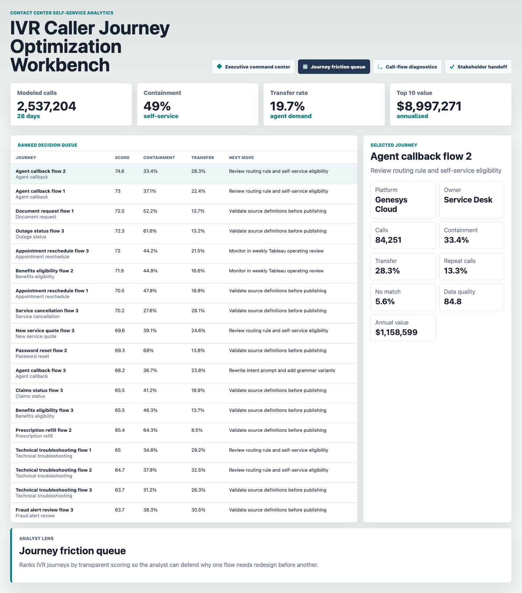
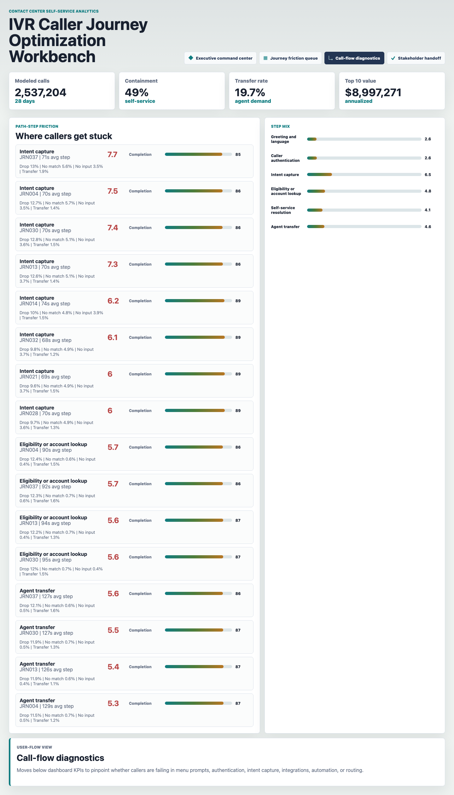
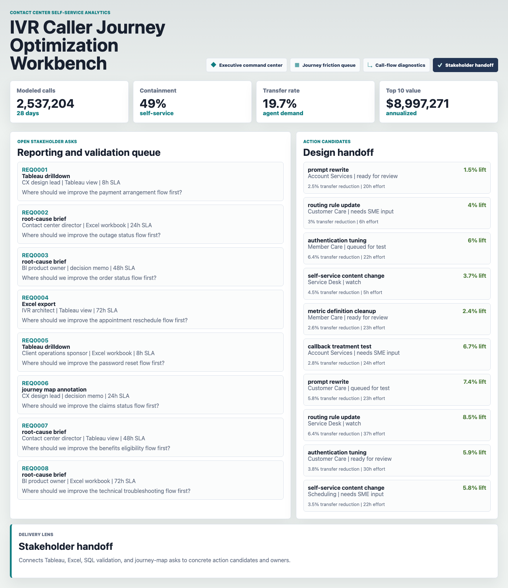

# IVR Caller Journey Optimization Workbench

Portfolio artifact for a Data Analyst role supporting contact center self-service, IVR reporting, and caller experience optimization. The workbench shows how an analyst can turn raw IVR behavior signals into Tableau-ready views, SQL validation checks, and stakeholder recommendations for journey redesign.

## Portfolio Surface



**Executive command center:** Summarizes modeled call volume, containment, transfer pressure, annualized value opportunity, the highest-priority IVR journey, and the next action a CX stakeholder should review.



**Journey friction queue:** Ranks IVR journeys with a transparent priority score that combines volume, transfer cost, containment gap, abandon rate, no-match and no-input friction, authentication failure, repeat calls, and data quality.



**Call-flow diagnostics:** Breaks the dashboard down into user-flow steps so the analyst can explain whether callers are getting stuck in menu prompts, authentication, intent capture, account lookup, self-service resolution, or routing.



**Stakeholder handoff:** Connects Tableau, Excel, SQL validation, root-cause briefs, and journey-map asks to owner-ready action candidates with expected lift, transfer reduction, effort, and status.

## What This Demonstrates

- SQL-style thinking for IVR journey rollups, path-step diagnostics, and stakeholder handoff queues.
- Tableau-ready metric framing for containment rate, transfer rate, no-match rate, no-input rate, authentication failure rate, repeat-call rate, data quality score, and priority score.
- Caller journey analysis that goes beyond a dashboard by identifying where the IVR flow breaks and what should change next.
- Collaboration support for CX design leads, contact center directors, BI product owners, IVR architects, and operations sponsors.

## Data Strategy

The artifact uses deterministic synthetic data because granular IVR path logs, authentication outcomes, speech or DTMF misses, transfer reasons, and repeat-call behavior are sensitive operational records.

The generator in `scripts/score_operating_data.py` creates:

- 42 IVR journeys across common contact center intents, owner teams, platforms, entry channels, authentication requirements, and complexity levels.
- 1,176 daily journey metric rows covering 28 days of containment, transfer, abandonment, repeat calls, prompt friction, authentication failure, handle time, and Tableau refresh status.
- 5,684 path-step records for greeting, authentication, intent capture, account lookup, self-service resolution, and agent transfer.
- 90 stakeholder reporting requests for Tableau views, Excel workbooks, decision memos, SQL validation, and journey annotations.
- 168 recommendation actions with expected containment lift, transfer reduction, owner, effort, and status.

Synthetic assumptions are documented in `data/README.md`. Call volume uses normal variation around journey baselines with weekday effects. Containment, transfer, abandon, no-match, no-input, and authentication failure rates vary by journey type, authentication requirement, and complexity. Transfer-cost opportunity is calculated from modeled transfer volume, target containment gap, and estimated cost per transferred call.

## Analysis Assets

- `analysis/sql_checks.sql`: SQL examples for journey performance, path-step friction, and stakeholder handoff queues.
- `analysis/tableau_measure_catalog.md`: Tableau-style measure definitions and business use.
- `analysis/executive_findings.md`: Short findings summary for stakeholder review.
- `analysis/outputs/priority_queue.csv`: Scored journey queue used by the front end.
- `analysis/outputs/flow_diagnostics.csv`: Aggregated flow-step friction diagnostics.
- `analysis/outputs/app_payload.json`: Static app payload generated from the synthetic source data.

## Run Locally

```bash
python3 scripts/score_operating_data.py
python3 -m http.server 4173
```

Open `http://localhost:4173`.

To refresh screenshots after changing the UI:

```bash
npm run screenshots -- http://127.0.0.1:4173/
```

## Scope

This is a static portfolio artifact with reproducible synthetic data and transparent scoring logic. It does not connect to a live IVR platform, contact center platform, CRM, Tableau Server, data warehouse, speech-recognition engine, call recordings, transcripts, or production customer data. It does show how an analyst can structure IVR data, validate metrics, build Tableau-ready outputs, diagnose caller-flow friction, and translate findings into stakeholder-ready CX recommendations.
